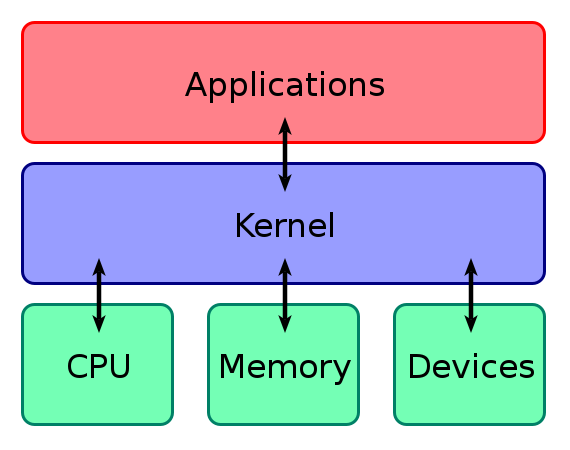

# Computing Environment  
* "The computing environment involves the collection of computer machinery, data storage devices, work stations, software applications, and networks that support the processing and exchange of electronic information..." -[Computing Environment](https://www.sciencedirect.com/topics/computer-science/computing-environment) 

*What does this all mean?* 

## What is your environment?  
* How can you interact with your environment (local, virtual, cloud)?  
* There are different affordances and limitation in each environment, you will make different choices depending on the needs of you project or the needs of your classroom. 

## Local environments
- Your laptop or desktop or tablet, etc. is your local environment. 
* The applications on your device can access the resources in your machine. Each local environment becomes different with use. 
* The [kernel](https://en.wikipedia.org/wiki/Kernel_(operating_system)) connects the application software to the hardware of a computer.

* Local installations give you more control, and more power, but the pedagogical tradeoff is that it is more difficult to manage and configure during class. Installation is dependent on type of device. 

* The process of installing and learning how to work on your computer encourages more active troubleshooting as well, which is a useful long-term skill.

### Installing software
- Requires [Administrative permissions](https://www.smu.edu/oit/services/make-me-admin#:~:text=Administrative%20privileges%20may%20be%20required,web%20carries%20an%20increased%20risk.)
- Learning to install software
- Learning how to install software is an important part of the process of gaining computational literacy and learning how the programs we use work. 
- [Basics of Software Installation](https://www.codecademy.com/article/basics-of-software-installation)
- [Understanding Applications](https://edu.gcfglobal.org/en/computerbasics/understanding-applications/1/)

## Virtual environments

A virtual environment is a digital instance of a local computing environment that can perform almost all the same functions as that local machine, ["including running applications and operating systems. Virtual machines run on a physical machines"](https://cloud.google.com/learn/what-is-a-virtual-machine)... using specialized software or internet browsers.

## Containers
Containers are a type of [operating system virtualization](https://en.wikipedia.org/wiki/OS-level_virtualization) where a single kernel is shared by all operating systems. 

This is contrasted with virtual machines that provide a virtualized hardware environment upon which an operating system can run. Containers, as such, are lightweight compared to virtual machines, but are restricted to a single kernel type, e.g., Linux. The primary benefits on containers are:

- Isolation
- Reproducibility
- Portability 
* Access to HPCs is also contingent on circumstances; you may not have access to HPC in the future. 

Singularity and Docker are popular tool sets used to create and manage containers on Linux. For security reasons, Docker is not usually allowed on HPC systems and this includes M2. M2 does have Singularity, which is largely compatible with Docker containers. -[Explanation from: Creating Portable Environments with Singularity and Docker.](https://github.com/SouthernMethodistUniversity/singularity_docker) 

- Virtual environments have high variability.

 - They can run a single piece of software or OS with suites of software. When you are considering using a virtual envorinment, in addition to what it is capable of doing, you should consider the following: portability (ease of set up), reproducibility (its' capabilities and consistency of experience) and isolation (if you working in shared envorinment and your work needs to be sequestered.)

The advantages of containers for for [classroom projects](https://digitalfellows.commons.gc.cuny.edu/2016/11/15/docker-in-the-classroom-creating-a-virtual-environment-for-instruction/) are:
  * you want all students to be using the same environment, without worrying about different operating systems (OS) and [individual installations](https://sorrelharriet.medium.com/docker-in-the-classroom-part-1-3d86fea9160c)
- Portability 
*  You may not have access to an HPC
* There are additional types of computing environments listed [here](https://www.geeksforgeeks.org/computing-environments/)

## The "Cloud"
- ["Cloud computing](https://en.wikipedia.org/wiki/Cloud_computing) is the on-demand availability of computer system resources, especially data storage (cloud storage) and computing power, without direct active management by the user.Cloud computing is the on-demand availability of computer system resources, especially data storage (cloud storage) and computing power, without direct active management by the user."

* Cloud based systems may be expensive, it may be resources intensive, so you may choose the path of [Minimal Computing](https://go-dh.github.io/mincomp/about/): "We use “minimal computing” to refer to computing done under some set of significant constraints of hardware, software, education, network capacity, power, or other factors. Minimal computing includes both the maintenance, refurbishing, and use of machines to do DH work out of necessity along with the use of new streamlined computing hardware like the Raspberry Pi or the Arduino micro controller to do DH work by choice. This dichotomy of choice vs. necessity focuses attention on computing that is decidedly not high-performance."
* Using the resource tha matches your needs can help you minimize costs and environmental impact.

# What does this all mean? Why are we telling you all this? 

* This is useful contextual information for you if you choose to go forward with learning programming. 

Advantages of using an cloud based M II account:
- M II is already set up to work well on any device, and it will have software pre-installed accessible via Internet.
- Ownership and group access (access is contingent upon association with SMU).
- You don’t have to install any software on your own computer.
 - Cloud-based notebooks

Advantages cloud-based notebooks give instructors: 
- More control on what we give access to for participants.
- Can create structured projects for participants.
- Versions are more controlled compared to installed versions.
- Reproducible and sharable
- Less reliant on strength of computer.
- You may also see references to [Jupyter notebooks](https://jupyter.org/) in other digital humanities workshops.  
- We are choosing for the sake of pedagogy and time to skip local installation. However, if you want to learn to code, you may want to installing a virtual envorinment with the porgramming language you want to learn and an IDE.

### Jupyter Notebooks
* If you are unfamiliar with Jupyter Notebooks, take a look at one of these introductory lessons.
* [Getting Started with Jupyter Notebooks - ITHAKA Constellate](https://ithaka.github.io/tdm-notebooks/getting-started-with-jupyter.html) 
  * Description: This lesson introduces Jupyter notebooks and Python for absolute beginners. If you are completely new to text analysis, this is the place to start.
* [Introduction to Jupyter Notebooks - Programming Historian](https://programminghistorian.org/en/lessons/jupyter-notebooks)

When doing an introductory coding workshop, instructors choose between using the local environment, virtual environment a cloud-based environment. There are good pedagogical reasons for each choice. 
[Cloud-based Versus Local-Based Web Development Education: An Experimental Study in Learning Experience.](https://files.eric.ed.gov/fulltext/EJ1144677.pdf)

 

-----
#### Attribution 

Session Leaders:  [Rafia Mirza](http://guides.smu.edu/prf.php?account_id=142826/) 
* Written by Rafia Mirza. 

When sharing this material or derivative works, preserve this paragraph, changing only the title of the derivative work, or provide comparable attribution.

